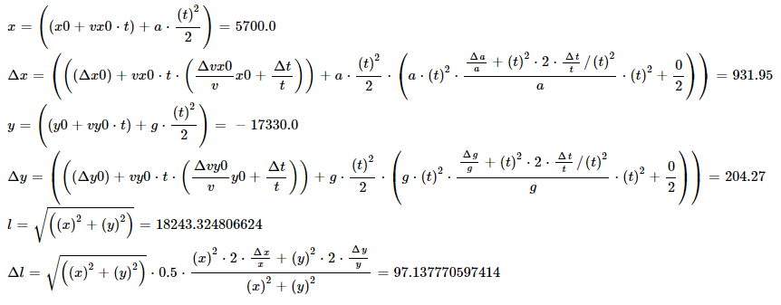

# Error propagation using Lua

The expression `input("x", x, Δx)` denotes a value named "x" with a value of x ± Δx. You can use all standard math operators
on these values and the result will contain the propagated error as well as the expression used to obtain both the value and error.
I built this tool to simplify the process of physics experiments, since error propagation calculation is often very deeply nested
and complicated.

### Example
[test.lua](test.lua) contains a demo on how to create some expressions and display them within an HTML file using MathJax.

Given time `t`, initial positions `x0`, `y0`, initial velocities `vx0`, `vy0` and horizontal acceleration `a`, the following
code will calculate the distance between `(0, 0)` and the object after `t` seconds:
```lua
local t = input("t", 60, 0.01)
local x = input("x0", 0, 0.1) + input("vx0", 5, 0.5)*t + input("a", 3, 0.5)*t^2/2
local y = input("y0", 10, 0.1) + input("vy0", 5, 0.5)*t + input("g", -9.8, 0.1)*t^2/2
local length = vsqrt(x^2 + y^2)
```
The error and value of `length` can be accessed using `length.val` and `length.err`. Each of these values are
tables containing the result `val` and textual expression `name`.

Using MathJax, you can beautify the expressions. The end result looks something like this:

